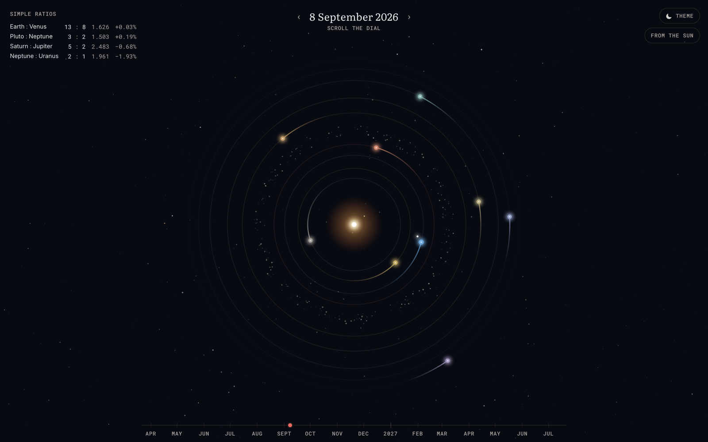

# Year at a Glance



An art piece about proportion. The solar system as a dial: where the planets
stand on a given day, the simple angles between them, and how their years
divide into one another.

**Live:** https://year-at-a-glance-beta.vercel.app

## What it draws

- **A heliocentric dial.** The Sun at the centre, the planets on rings, each with
  a tail for the arc it has just travelled. Distances run from 0.4 to 30 AU, so
  the rings are spaced for reading rather than to scale: every angle on the dial
  is exact, no radius is. A degree scale at the rim gives every position its
  coordinate, zero at three o'clock, counting counterclockwise.
- **Relations as lines.** Two planets standing at a simple fraction of a circle
  from each other are joined by one thin arc bowed outward. The nearer they
  stand to the exact fraction, the heavier the line. Click the Sun to show every
  relation, a planet for its own; a card gives the numbers.
- **Simple ratios.** The pairs whose orbital periods stand near a ratio of small
  whole numbers, with the computed ratio next to the ideal: Earth : Venus 13:8,
  Pluto : Neptune 3:2, Saturn : Jupiter 5:2, Neptune : Uranus 2:1. Periods are
  fitted from the ephemeris, not typed in. Pointing at a row lifts the pair's
  orbits on the dial.
- **A ruler.** Sixteen months at a time; scroll the dial or drag the ruler to
  move the date, `R` or `T` to come back to today.

## What it does not do

No accounts, no tracking, no input. The sky is the same for everybody, which is
the only thing a public page can honestly show.

## Built with

Next.js, TypeScript, SVG. Ephemerides computed locally with
[astronomy-engine](https://github.com/cosinekitty/astronomy), no external
service and no API keys. Orbital periods are the mean motion of each body's
heliocentric longitude in the J2000 ecliptic, fitted over at least twelve
revolutions centred on the year 2000; see `src/lib/periods.ts`.

```bash
npm install
npm run dev
```
